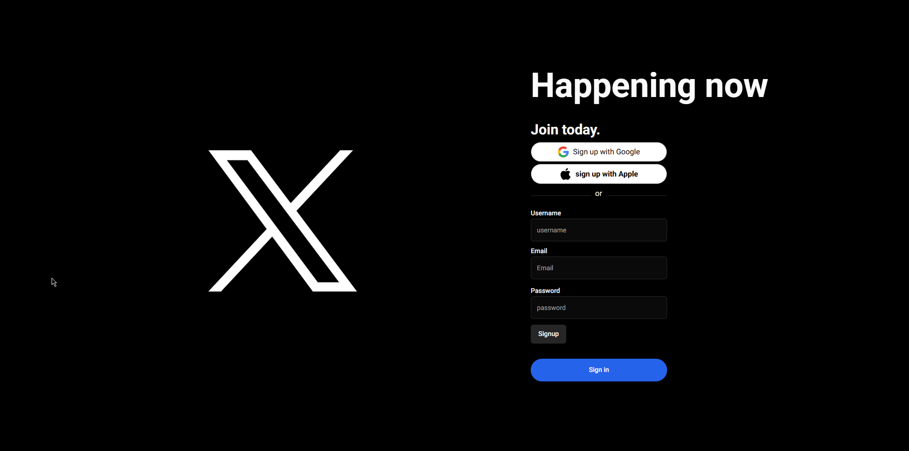
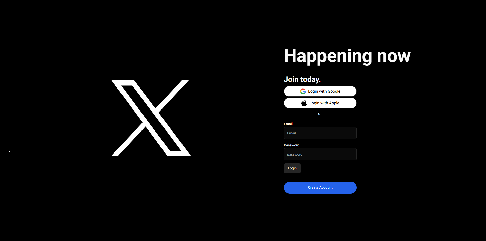
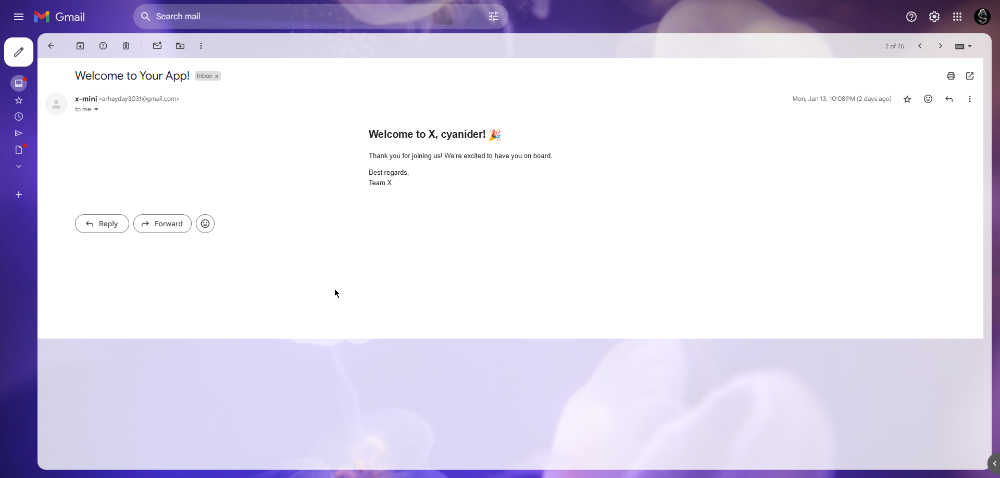
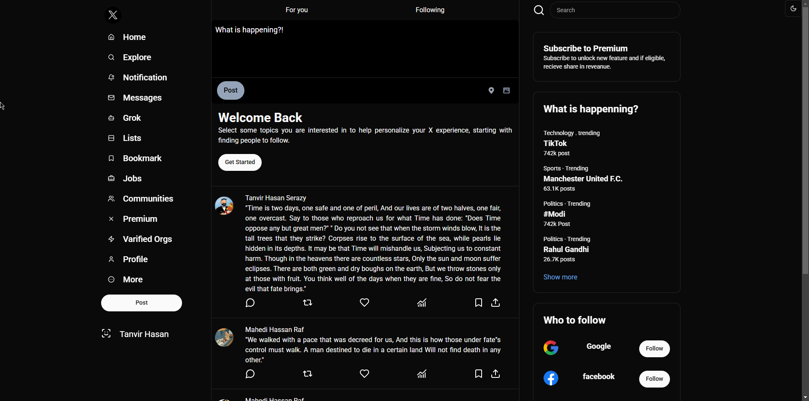
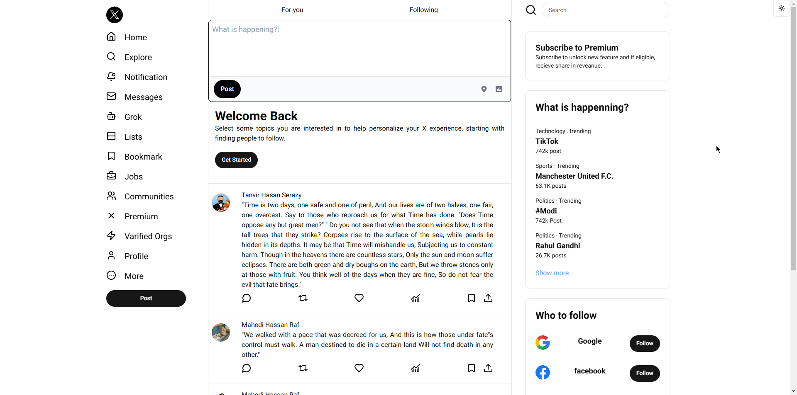

# Mini Version of X (Twitter Clone)

This project is a mini version of X (formerly known as Twitter) built as part of an assignment. It focuses on creating a basic social media platform with features such as user authentication, a homepage displaying posts, and other features.

## Features Implemented

1. **Signup and Signin**

   - Users can register and log in to their accounts.
   - Upon successful signup, users receive a welcome email.

2. **Homepage**
   - A clean homepage displaying posts.

## Screenshots







## Features Not Fully Implemented

1. Follow other users.
2. Comment on posts.

These features are in progress and can be added in future updates.

## Tech Stack

- **Frontend**: Next.js , Tailwind CSS
- **Backend**: Node.Js, Express
- **Database**: MySQL

## How to Run the Project

1. Clone this repository:

   ```bash
   git clone <repository-link>
   ```

2. Navigate to the project directory:

   ```bash
   cd project-directory
   ```

3. Install dependencies for the backend:

   ```bash
   npm install
   ```

4. Install dependencies for the frontend:

   ```bash
   npm install
   ```

5. Set up the database:

   - Run the XAMP Control Panel and Start Apache & MySQL Server.
   - Create a MySQL database naming mini-x.
   - Update the `.env` file with your database & mailtrap or Google credentials.

6. Start the backend server:

   ```bash
   nodemon
   ```

7. Start the frontend development server:

   ```bash
   npm run dev
   ```

8. Open the application in your browser at `http://localhost:3000`.

9. To visit homepage go to `http://localhost:3000/homepage`.

## Project Highlights

- **Authentication**: Secure user authentication with validation and email confirmation.
- **Modern Design**: A clean and intuitive homepage design.
- **Scalable Codebase**: Modular and well-structured code for easier future enhancements.

## Future Improvements

- Adding the functionality to follow other users.
- Enabling comments on posts.
- Enhancing UI/UX for better user experience.

## Challenges Faced

- Implementing the "follow user" and "comment" features within the tight deadline.
- Managing both frontend and backend integration in a limited time frame.

## Conclusion

Although all features were not fully implemented within the timeframe, the project demonstrates strong foundational skills in building full-stack applications. With more time, the remaining features will be completed.

---

Thank you for reviewing this project! Feel free to reach out for any questions or clarifications.
